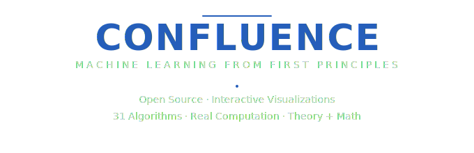
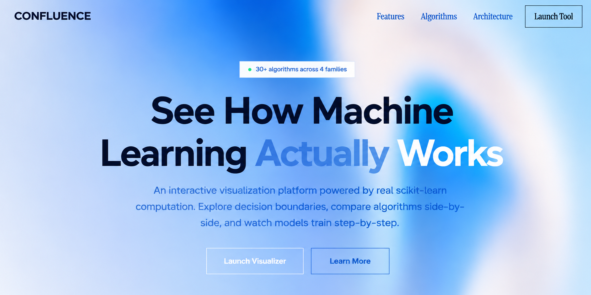
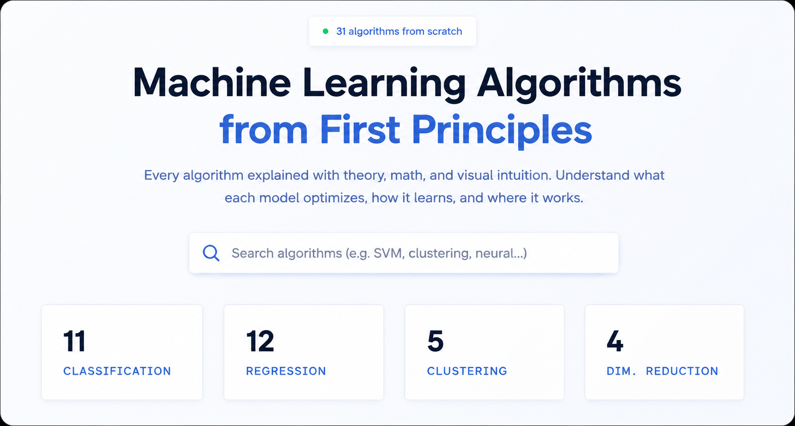
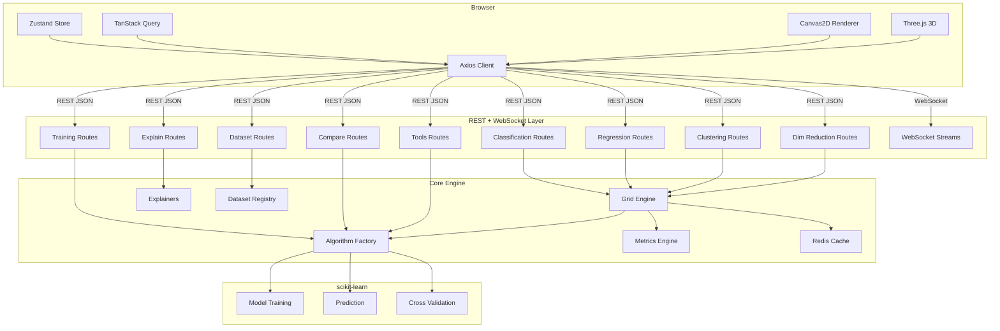

<div align="center">

<br />



<br />

An interactive, production-grade ML visualization and education platform backed by real scikit-learn computation.
Explore **38 algorithms** across classification, regression, clustering, and dimensionality reduction — with **24 datasets**, real-time training animation, prediction explanations, algorithm comparison, and an AI assistant.

<br />


<br />

[Getting Started](#-getting-started) · [Features](#-features) · [Architecture](#-architecture) · [API Reference](#-api-reference) · [Algorithm Catalog](#-algorithm-catalog) · [Contributing](CONTRIBUTING.md)

<br />



<br />

---

</div>

## Table of Contents

- [Why Confluence?](#-why-confluence)
- [Features](#-features)
- [Algorithm Encyclopedia](#algorithm-encyclopedia)
- [Getting Started](#-getting-started)
- [Architecture](#-architecture)
- [Project Structure](#-project-structure)
- [Algorithm Catalog](#-algorithm-catalog)
- [Dataset Catalog](#-dataset-catalog)
- [API Reference](#-api-reference)
- [Configuration](#-configuration)
- [Verification & Testing](#-verification--testing)
- [Tech Stack](#-tech-stack)
- [Performance & Caching](#-performance--caching)
- [Contributing](#-contributing)
- [License](#-license)

---

## Why Confluence?

Most ML visualization tools fall into two traps:

| Trap | Example | Problem |
|------|---------|---------|
| **Toy and shallow** | TensorFlow Playground, CodePen demos | Client-side-only math, covers 3-4 algorithms, no regression/clustering/dim-reduction |
| **Static and academic** | scikit-learn gallery, Distill.pub | Good math, zero interactivity, fixed datasets, no hyperparameter exploration |

**Confluence closes the gap** — a unified, interactive ML education platform backed by genuine `scikit-learn`-class computation, spanning four algorithm families, with synchronized comparison, training-process animation, prediction explanations, and a geometric taxonomy of decision boundaries as the organizing idea.

### Core Differentiators

```
┌─────────────────────────────────────────────────────────────────────────┐
│  1. Boundary Taxonomy          Algorithms tagged by geometric shape     │
│  2. Four Families, One UI      Classification · Regression · Cluster    │
│  3. Real Computation           Actual scikit-learn, not toy math        │
│  4. Training Playground        Watch models learn step-by-step          │
│  5. Explain Every Prediction   Decision paths, feature contributions    │
│  6. Algorithm Race             Run multiple algorithms simultaneously   │
│  7. 24 Real-World Datasets     Iris, Titanic, Housing, and more         │
│  8. AI Assistant               Context-aware ML explanations            │
└─────────────────────────────────────────────────────────────────────────┘
```

---

## Features

### Visualization Engine
- **Decision boundaries** rendered as Canvas2D heatmaps with crisp contour overlays
- **Real-time hyperparameter sliders** with debounced recompute (resolution 1-200)
- **Probability gradients** — see confidence, not just class labels
- **3D mode** via Three.js/react-three-fiber for GP uncertainty surfaces and embedding projections

### Dataset Gallery (24 datasets)
- **Synthetic**: blobs, moons, spirals, XOR, checkerboard, linearly separable
- **Real-world**: Iris, Wine, Breast Cancer, Digits, Titanic, Penguins, Heart Disease, Adult Income, Mushroom, Wine Quality, California Housing, Diabetes, Bike Sharing, Insurance, Concrete, Mall Customers, Wholesale Customers, Seeds
- **Categorized selector** with source toggle (Synthetic / Real World) and category filters
- **Dataset info panel** showing story, stats, features, recommended algorithms
- **Data Generator Studio** — generate spirals, XOR, gaussian, moons, circles, or draw custom datasets

### Training Playground
- **Animated training** — watch logistic regression learn via gradient descent, MLP weight updates, decision tree depth growth, KNN k-sweep, boosting rounds
- **Loss curve** and **accuracy history** in real-time alongside the decision boundary
- **Playback controls** — play, pause, step forward/back, scrubber timeline

### Explain Every Prediction
- **Click any point** to see: prediction, probability, and full explanation
- **Decision path** for tree-based models (split feature, threshold, Gini at each node)
- **Feature contributions** for linear models (weight × value per feature)
- **Feature importance** for ensemble models
- **Nearest neighbors** for KNN models

### Learning Mode
- **Toggle ON** to get context-aware explanations when clicking the canvas
- **Boundary explanations** — why the boundary is shaped this way
- **Hyperparameter effects** — what changing C, max_depth, n_neighbors actually does

### Metric Explanations
- **Click any metric** (accuracy, precision, recall, F1) to see: formula, calculation, interpretation
- **Per-class breakdown** showing where the model succeeds and fails
- **Confusion matrix breakdown** with TP/TN/FP/FN labels

### Algorithm Comparison
- **Hyperparameter Comparison** — 4 configs side-by-side (e.g., max_depth 2, 5, 10, 20) with overfit detection
- **Algorithm Race** — run multiple algorithms simultaneously via WebSocket, real-time leaderboard
- **Benchmark Suite** — cross-algorithm, cross-dataset accuracy heatmap and speed ranking
- **Side-by-side mode**: 2-4 algorithms on the same dataset with synchronized zoom/pan

### Interactive Visualizations
- **Interactive Confusion Matrix** — click TP/TN/FP/FN to highlight those points on the canvas
- **Interactive ROC Curve** — hover to see threshold, FPR, TPR at any point
- **Interactive PR Curve** — hover to see threshold, precision, recall
- **Wrong Prediction Explorer** — see expected class, predicted class, probability, decision path, nearest correct neighbors

### PCA Explorer
- **Projection canvas** showing data in PC1 vs PC2 space
- **Scree plot** with variance per component
- **Feature loadings** showing which features contribute to each principal component
- **Cumulative variance** explained

### Code Generator
- **Auto-generates Python code** matching your current algorithm, dataset, and hyperparameters
- **Copy to clipboard** or **download as .py** file
- **Updates automatically** when you change configuration

### AI Assistant
- **Chat interface** with context-aware ML explanations
- **Quick questions** for common queries (overfitting, boundaries, metrics)
- **Works with or without LLM API** — built-in fallback for common questions

### Step-by-Step Tree Builder
- **Animated tree construction** — watch splits grow depth by depth
- **Tree visualization** showing nodes, thresholds, Gini values, class counts
- **Synced with decision boundary** — see how each split changes the boundary

### ML Roadmap
- **7 learning categories**: Statistics, Linear Algebra, Optimization, Feature Engineering, Evaluation, Model Selection, Deployment
- **Each topic** links to relevant Confluence features for hands-on practice
- **External resources** for deeper learning

### Other Tools
- **Cross-validation** with per-fold boundary visualization
- **Coefficient inspector** for linear/tree models
- **Learning curves** showing train vs. validation performance
- **Sensitivity heatmaps** for hyperparameter interaction analysis
- **Boundary taxonomy explorer**: filter algorithms by geometric boundary type
- **Algorithm encyclopedia**: 38 algorithms with complexity, intuition, and SVG diagrams

---

## Algorithm Encyclopedia

Confluence ships with a dedicated **Algorithm Encyclopedia** — an interactive reference covering all 38 algorithms with rich detail, organized by family.



### What the Encyclopedia Offers

| Feature | Description |
|---------|-------------|
| **38 Algorithm Cards** | Every algorithm across classification, regression, clustering, and dimensionality reduction — each with a one-line intuition, complexity notes, and boundary taxonomy tag |
| **Organized by Family** | Algorithms are grouped into four families with clear visual separation — Classification, Regression, Clustering, and Dimensionality Reduction |
| **Boundary Taxonomy Tags** | Each algorithm is tagged by the geometric shape of its decision boundary — Linear, Tree-Based, Instance-Based, Margin/Kernel, Probabilistic, Neural, Boosting, and more |
| **Search & Filter** | Instantly search algorithms by name or filter by family to find the right tool for your dataset |
| **Complexity Reference** | Every card shows Big-O complexity for both fit and predict operations, helping you reason about scalability |
| **SVG Diagrams** | Visual diagrams illustrate the intuition behind each algorithm's decision-making process |
| **Interactive Launch** | Click any algorithm card to jump directly into the visualizer with that algorithm pre-selected |

---

## Getting Started

### Prerequisites

| Tool | Version | Check |
|------|---------|-------|
| Python | 3.11+ | `python --version` |
| Node.js | 20+ | `node --version` |
| Redis | 7+ (optional) | `redis-cli ping` |

### Quick Start (Local Development)

```bash
# 1. Clone
git clone <repo-url>
cd Confluence

# 2. Backend
cd backend
pip install -r requirements.txt
python -m uvicorn app.main:app --reload --port 8000

# 3. Frontend (new terminal)
cd frontend
npm install
npm run dev
```

Open **[http://localhost:3000](http://localhost:3000)** → click **Launch App** → select an algorithm and dataset.

### Docker Compose (Recommended for Full Stack)

```bash
docker compose up --build
```

This starts three services:
- `frontend` — Next.js on port 3000
- `backend` — FastAPI on port 8000
- `redis` — Redis on port 6379

### Verify Installation

```bash
make typecheck     # Frontend TypeScript
make lint          # Frontend ESLint
make test-backend  # Backend pytest
```

---

## Architecture

### System Overview



---

## Project Structure

```
Confluence/
├── backend/
│   ├── app/
│   │   ├── main.py                         # FastAPI app, CORS, exception handlers
│   │   ├── cache.py                        # Redis caching layer (async)
│   │   ├── grid.py                         # Meshgrid generation + contour extraction
│   │   ├── algorithms/
│   │   │   ├── classification.py           # 15 classification algorithms
│   │   │   ├── regression.py               # 13 regression algorithms
│   │   │   ├── clustering.py               # 5 clustering algorithms
│   │   │   ├── dim_reduction.py            # 5 dimensionality reduction algorithms
│   │   │   ├── datasets.py                 # Synthetic dataset generators + registry bridge
│   │   │   ├── metrics.py                  # Metrics, CV, learning curves, sensitivity
│   │   │   ├── explainers/                 # Prediction, learning, metric explainers
│   │   │   └── generators/                 # Data generator studio
│   │   ├── datasets/
│   │   │   ├── registry.py                 # Central dataset registry
│   │   │   ├── metadata.py                 # DatasetEntry dataclass
│   │   │   ├── loaders.py                  # Register all datasets
│   │   │   ├── classification/             # 14 classification dataset loaders
│   │   │   ├── regression/                 # 7 regression dataset loaders
│   │   │   └── clustering/                 # 3 clustering dataset loaders
│   │   ├── models/
│   │   │   └── schemas.py                  # Pydantic request/response models
│   │   └── routers/
│   │       ├── classification.py           # Classification endpoints
│   │       ├── regression.py               # Regression endpoints
│   │       ├── clustering.py               # Clustering endpoints
│   │       ├── dim_reduction.py            # Dim-reduction endpoints
│   │       ├── datasets.py                 # CSV upload, custom points, v2 dataset API
│   │       ├── explain.py                  # Prediction & metric explanations
│   │       ├── training.py                 # Training playground & wrong predictions
│   │       ├── compare.py                  # Hyperparameter comparison, race, benchmark
│   │       ├── tools.py                    # PCA explorer, code gen, AI assistant
│   │       ├── streaming.py                # WebSocket training animation + tree builder
│   │       └── health.py                   # Health check
│   ├── tests/                              # 41 tests (pytest + httpx)
│   ├── Dockerfile
│   ├── requirements.txt
│   └── pyproject.toml
│
├── frontend/
│   ├── src/
│   │   ├── app/
│   │   │   ├── page.tsx                    # Landing page
│   │   │   ├── app/page.tsx                # Main visualizer
│   │   │   ├── algorithms/page.tsx         # Algorithm encyclopedia
│   │   │   └── resources/page.tsx          # ML Roadmap
│   │   ├── components/
│   │   │   ├── canvas/                     # Canvas2D renderers (7 files)
│   │   │   ├── comparison/                 # Side-by-side, hyperparam, race, benchmark
│   │   │   ├── controls/                   # Algorithm panel, dataset selector, sliders
│   │   │   ├── explain/                    # Prediction explainer, tree builder, learning mode
│   │   │   ├── training/                   # Training playground, confusion matrix, ROC/PR
│   │   │   ├── tools/                      # PCA explorer, code gen, AI assistant
│   │   │   ├── metrics/                    # 9 metric visualization components
│   │   │   ├── streaming/                  # WebSocket training viz
│   │   │   ├── taxonomy/                   # Boundary taxonomy explorer
│   │   │   ├── three/                      # 3D scene (Three.js)
│   │   │   ├── landing/                    # Landing page animations
│   │   │   ├── layout/                     # Navbar, footer
│   │   │   └── ui/                         # URL state, theme toggle
│   │   └── lib/
│   │       ├── api/client.ts               # Axios API client + typed functions
│   │       ├── api/types.ts                # Auto-generated OpenAPI types
│   │       ├── store/index.ts              # Zustand store (38 algorithms, 24 datasets)
│   │       └── taxonomy/index.ts           # Boundary taxonomy definitions
│   ├── Dockerfile
│   ├── package.json
│   ├── tsconfig.json
│   └── next.config.ts
│
├── docs/
│   ├── deployment.md                       # Full deployment guide
│   ├── API.md                              # API reference
│   ├── ARCHITECTURE.md                     # System architecture
│   └── DEVELOPMENT.md                      # Developer guide
│
├── .github/
│   ├── ISSUE_TEMPLATE/
│   │   ├── new_algorithm.md                # Algorithm request template
│   │   ├── new_dataset.md                  # Dataset request template
│   │   └── feature_request.md              # Feature request template
│   └── PULL_REQUEST_TEMPLATE.md            # PR template with checklist
│
├── plans/                                  # Implementation plans (6 phases)
├── docker-compose.yml                      # 3-service orchestration
├── Makefile                                # Build commands
├── CONTRIBUTING.md                         # Contribution guidelines with templates
├── .env.example                            # Environment variable template
├── .nvmrc                                  # Node.js 20
└── .python-version                         # Python 3.11
```

---

## Algorithm Catalog

### Classification (15 algorithms)

| Algorithm | Key | Boundary Type | Complexity (Fit) | Complexity (Predict) |
|-----------|-----|---------------|------------------|---------------------|
| Logistic Regression | `logistic-regression` | Linear | O(n·d) | O(d) |
| K-Nearest Neighbors | `knn` | Instance-Based | O(1) | O(n·d) |
| Decision Tree | `decision-tree` | Tree-Based | O(n·d·log n) | O(log n) |
| SVM (RBF) | `rbf-svm` | Margin / Kernel | O(n²·d) | O(sv·d) |
| SVM (Linear) | `linear-svm` | Linear | O(n·d) | O(d) |
| SVM (Polynomial) | `poly-svm` | Margin / Kernel | O(n²·d) | O(sv·d) |
| Random Forest | `random-forest` | Tree-Based | O(k·n·d·log n) | O(k·log n) |
| Extra Trees | `extra-trees` | Tree-Based | O(k·n·d·log n) | O(k·log n) |
| AdaBoost | `adaboost` | Boosting | O(T·n·d) | O(T) |
| Gradient Boosting | `gradient-boosting` | Boosting | O(T·n·d·log n) | O(T·log n) |
| Gaussian Naive Bayes | `gaussian-nb` | Probabilistic | O(n·d) | O(d) |
| QDA | `qda` | Probabilistic | O(n·d²) | O(d²) |
| Gaussian Process | `gp-classifier` | Probabilistic | O(n³) | O(n²) |
| Perceptron | `perceptron` | Linear | O(n·d·i) | O(d) |
| MLP Classifier | `mlp` | Neural | O(n·d·h·i) | O(d·h) |

### Regression (13 algorithms)

| Algorithm | Key | Boundary Type | Complexity (Fit) |
|-----------|-----|---------------|------------------|
| Linear Regression | `linear-regression` | Linear | O(n·d²) |
| Ridge | `ridge` | Linear | O(n·d²) |
| Lasso | `lasso` | Linear | O(n·d·i) |
| Elastic Net | `elastic-net` | Linear | O(n·d·i) |
| Decision Tree Regressor | `decision-tree-regressor` | Tree-Based | O(n·d·log n) |
| Random Forest Regressor | `random-forest-regressor` | Tree-Based | O(k·n·d·log n) |
| Gradient Boosting Regressor | `gradient-boosting-regressor` | Boosting | O(T·n·d·log n) |
| SVR (Linear) | `svr-linear` | Margin / Kernel | O(n²·d) |
| SVR (RBF) | `svr-rbf` | Margin / Kernel | O(n²·d) |
| SVR (Polynomial) | `svr-poly` | Margin / Kernel | O(n²·d) |
| KNN Regressor | `knn-regressor` | Instance-Based | O(1) |
| Gaussian Process | `gaussian-process-regressor` | Probabilistic | O(n³) |
| MLP Regressor | `mlp-regressor` | Neural | O(n·d·h·i) |

### Clustering (5 algorithms)

| Algorithm | Key | Category |
|-----------|-----|----------|
| K-Means | `kmeans` | Centroid-Based |
| DBSCAN | `dbscan` | Density-Based |
| Agglomerative | `agglomerative` | Hierarchical |
| Gaussian Mixture | `gmm` | Distribution-Based |
| Spectral | `spectral` | Graph-Based |

### Dimensionality Reduction (5 algorithms)

| Algorithm | Key | Category |
|-----------|-----|----------|
| PCA | `pca` | Linear |
| t-SNE | `tsne` | Manifold |
| UMAP | `umap` | Manifold |
| Isomap | `isomap` | Manifold |
| LDA | `lda` | Linear |

---

## Dataset Catalog

### Synthetic (9)

| Dataset | Description | Classes | Best For |
|---------|-------------|---------|----------|
| `blobs` | Gaussian blobs | 2 | Linear classifiers |
| `blobs-3class` | Gaussian blobs | 3 | Multi-class |
| `blobs-4class` | Gaussian blobs | 4 | Multi-class |
| `moons` | Interleaving half circles | 2 | Nonlinear boundaries |
| `circles` | Concentric circles | 2 | Kernel methods |
| `spirals` | Spiral patterns | 2 | Complex nonlinear |
| `xor` | XOR distribution | 2 | Tree/kernel methods |
| `linearly-separable` | Linearly separable | 2 | Baseline linear |
| `checkerboard` | Checkerboard pattern | 2 | Piecewise boundaries |

### Classification — Real-World (11)

| Dataset | Features | Classes | Category | Source |
|---------|----------|---------|----------|--------|
| `iris` | petal length, petal width | 3 | General | Fisher's Iris |
| `iris-full` | 4 features | 3 | General | Fisher's Iris |
| `wine` | alcohol, proline | 3 | General | UCI Wine |
| `wine-full` | 13 features | 3 | General | UCI Wine |
| `breast-cancer` | radius, texture | 2 | Healthcare | Wisconsin BC |
| `breast-cancer-full` | 30 features | 2 | Healthcare | Wisconsin BC |
| `digits-2d` | PCA-projected | 10 | General | sklearn Digits |
| `digits-full` | 64 pixel features | 10 | General | sklearn Digits |
| `titanic` | age, fare, sex, class | 2 | General | Synthetic |
| `penguins` | bill length, flipper | 3 | General | Synthetic |
| `heart-disease` | age, chol, HR | 2 | Healthcare | Synthetic |

### Classification — Extended (4)

| Dataset | Features | Classes | Category |
|---------|----------|---------|----------|
| `adult-income` | age, education, hours | 2 | Finance |
| `mushroom` | cap, gill, stem | 2 | General |
| `wine-quality` | acidity, alcohol | 2 | General |

### Regression (7)

| Dataset | Features | Category | Source |
|---------|----------|----------|--------|
| `california-housing` | income, age | Housing | sklearn |
| `california-housing-full` | 8 features | Housing | sklearn |
| `diabetes` | BMI, S5 | Healthcare | sklearn |
| `diabetes-full` | 10 features | Healthcare | sklearn |
| `bike-sharing` | temp, humidity, hour | Business | Synthetic |
| `insurance` | age, BMI, smoker | Finance | Synthetic |
| `concrete` | cement, water, age | Housing | Synthetic |

### Clustering (3)

| Dataset | Features | Clusters | Category |
|---------|----------|----------|----------|
| `mall-customers` | income, spending | 4 | Business |
| `wholesale-customers` | fresh, milk, grocery | 3 | Business |
| `seeds` | area, perimeter, compactness | 3 | General |

### Regression-Specific (1)

| Dataset | Description |
|---------|-------------|
| `sine` | sin(x) · cos(y) surface |

### Data Generators (7)

| Generator | Description |
|-----------|-------------|
| `spiral` | Interleaving spiral arms |
| `xor` | XOR pattern distribution |
| `gaussian` | Gaussian blob clusters |
| `moons` | Interleaving half circles |
| `circles` | Concentric circles |
| `linearly-separable` | Linearly separable |
| `swiss-roll` | Rolled manifold |

### Custom Data

- **CSV upload** — drag-and-drop any CSV, map columns to features/target
- **Custom points** — click on canvas to place points with class labels
- **Data Generator Studio** — generate datasets with configurable parameters

---

## API Reference

### Base URL

| Environment | URL |
|-------------|-----|
| Local | `http://localhost:8000` |
| Docker | `http://backend:8000` |
| Production | `https://your-api-domain.com` |

### Endpoints

#### Health

```
GET /health
→ { "status": "ok", "version": "0.1.0" }
```

#### Classification (8 endpoints)

```
POST /api/classification/predict          → PredictionResponse
POST /api/classification/metrics          → ClassificationMetrics
POST /api/classification/cross-validation → CrossValidationResponse
POST /api/classification/coefficients     → CoefficientResponse
POST /api/classification/learning-curve   → LearningCurveResponse
POST /api/classification/sensitivity      → SensitivityResponse
POST /api/classification/decision-path    → DecisionPathResponse
GET  /api/classification/datasets         → DatasetListResponse
```

#### Regression (5 endpoints)

```
POST /api/regression/predict              → RegressionResponse
POST /api/regression/metrics              → RegressionMetricsResponse
POST /api/regression/learning-curve       → LearningCurveResponse
POST /api/regression/cross-validation     → CrossValidationResponse
GET  /api/regression/datasets             → DatasetListResponse
```

#### Clustering (3 endpoints)

```
POST /api/clustering/predict              → ClusteringResponse
POST /api/clustering/elbow                → ClusteringElbowResponse
GET  /api/clustering/datasets             → DatasetListResponse
```

#### Dimensionality Reduction (2 endpoints)

```
POST /api/dim-reduction/reduce            → DimReductionResponse
GET  /api/dim-reduction/algorithms        → AlgorithmListResponse
```

#### Datasets (4 endpoints)

```
POST /api/datasets/upload                 → UploadResponse
POST /api/datasets/map-columns            → ColumnMappingResponse
POST /api/datasets/custom                 → CustomPointsResponse
POST /api/datasets/recommend              → RecommendResponse
```

#### Datasets V2 (4 endpoints)

```
GET  /api/datasets/v2/datasets            → DatasetListV2Response
GET  /api/datasets/v2/datasets/{name}     → DatasetDetailV2Response
GET  /api/datasets/v2/categories          → CategoryListResponse
POST /api/datasets/v2/generate            → GeneratorResponse
```

#### Explain (3 endpoints)

```
POST /api/explain/prediction              → ExplainPredictionResponse
POST /api/explain/metric                  → ExplainMetricResponse
POST /api/explain/learning-tip            → LearningTipResponse
```

#### Training (1 endpoint + 2 WebSockets)

```
POST /api/training/wrong-predictions      → WrongPredictionsResponse
WS   /ws/training-playground              → Training frames with loss/weights
WS   /ws/tree-build                       → Tree construction steps
```

#### Compare (2 endpoints + 1 WebSocket)

```
POST /api/compare/hyperparameter-comparison → HyperparamComparisonResponse
POST /api/compare/benchmark               → BenchmarkResponse
WS   /ws/compare/race                     → Algorithm race frames
```

#### Tools (3 endpoints)

```
POST /api/tools/pca-explore               → PCAResponse
POST /api/tools/generate-code             → CodeResponse
POST /api/tools/assistant                 → AssistantResponse
```

#### Streaming (1 WebSocket)

```
WS   /ws/stream                           → Training animation frames
```

### Interactive API Docs

- **Swagger UI**: [http://localhost:8000/docs](http://localhost:8000/docs)
- **ReDoc**: [http://localhost:8000/redoc](http://localhost:8000/redoc)
- **OpenAPI JSON**: [http://localhost:8000/openapi.json](http://localhost:8000/openapi.json)

---

## Configuration

### Environment Variables

| Variable | Service | Required | Default | Description |
|----------|---------|----------|---------|-------------|
| `CORS_ORIGINS` | Backend | Yes | `http://localhost:3000` | Comma-separated allowed origins |
| `REDIS_URL` | Backend | No | `redis://localhost:6379` | Redis URL (gracefully degrades) |
| `LOG_LEVEL` | Backend | No | `INFO` | Logging level |
| `NEXT_PUBLIC_API_URL` | Frontend | Yes | `http://localhost:8000` | Backend API URL |
| `NEXT_PUBLIC_WS_URL` | Frontend | No | `ws://localhost:8000` | WebSocket URL |
| `LLM_PROVIDER` | Backend | No | — | LLM provider (`openai`) |
| `LLM_API_KEY` | Backend | No | — | LLM API key |
| `LLM_MODEL` | Backend | No | `gpt-4o-mini` | LLM model name |

### Copy Environment Template

```bash
cp .env.example .env
```

---

## Verification & Testing

### Commands

```bash
make typecheck      # Frontend TypeScript type checking
make lint           # Frontend ESLint
make test-backend   # Backend pytest (41 tests)
make install        # Install all dependencies
```

### Windows (PowerShell)

```powershell
.\verify.ps1 -All           # Run all checks
.\verify.ps1 -Typecheck     # TypeScript only
.\verify.ps1 -TestBackend   # Backend tests only
.\verify.ps1 -Install       # Install dependencies
```

### CI Pipeline

GitHub Actions runs on every push:
- **Frontend job**: `npm ci` → `lint` → `typecheck` → `build`
- **Backend job**: `pip install` → import validation

---

## Tech Stack

| Layer | Technology | Purpose |
|-------|-----------|---------|
| **Framework** | Next.js 15 (App Router) | Routing, SSR/CSR, deploy target |
| **Language** | TypeScript 5 | Frontend type safety |
| **Styling** | Tailwind CSS 4 | Utility-first CSS |
| **Components** | Radix UI | Accessible primitives (Tabs, Slider, Dialog, Tooltip) |
| **Animation** | Framer Motion | Boundary morphs, panel transitions |
| **3D** | Three.js + react-three-fiber | GP surfaces, 3D projections |
| **Client State** | Zustand 5 | Algorithm/hyperparameter state |
| **Data Fetching** | TanStack Query 5 | Caching, dedup, request lifecycle |
| **HTTP Client** | Axios | API communication |
| **Backend** | FastAPI 0.115 | Prediction, metrics, streaming endpoints |
| **ML** | scikit-learn 1.6 | Real model fitting and prediction |
| **Numerics** | numpy 2.2, scipy 1.15 | Grid evaluation, contour extraction |
| **Contours** | scikit-image 0.25 | Contour extraction via `find_contours` |
| **Caching** | Redis 7 (optional) | Memoized prediction grids |
| **Validation** | Pydantic 2.10 | Request/response contracts |
| **Type Safety** | openapi-typescript | Auto-generated FE/BE type contracts |
| **Containers** | Docker Compose | Local dev + production parity |
| **Testing** | pytest + httpx | Backend test suite |

---

## Performance & Caching

### Redis Caching

Prediction grids are cached with a deterministic key based on:
- Algorithm name
- Hyperparameters (sorted)
- Dataset name
- Grid resolution

Cache TTL: **1 hour** (configurable). Redis is optional — the app works without it (caching disabled).

### Async ML Execution

All CPU-bound ML operations are wrapped in `asyncio.to_thread()` to prevent blocking the event loop.

---

## Contributing

See **[CONTRIBUTING.md](CONTRIBUTING.md)** for development setup, code quality standards, and detailed templates for adding new algorithms, datasets, and visualizations.

### Community Templates

- **[New Algorithm Request](.github/ISSUE_TEMPLATE/new_algorithm.md)** — Suggest a new algorithm
- **[New Dataset Request](.github/ISSUE_TEMPLATE/new_dataset.md)** — Suggest a new dataset
- **[Feature Request](.github/ISSUE_TEMPLATE/feature_request.md)** — Suggest a feature

---

## License

MIT

---

<div align="center">

**[Getting Started](#-getting-started)** · **[Features](#-features)** · **[Architecture](#-architecture)** · **[API Reference](#-api-reference)** · **[Contributing](CONTRIBUTING.md)**

</div>
