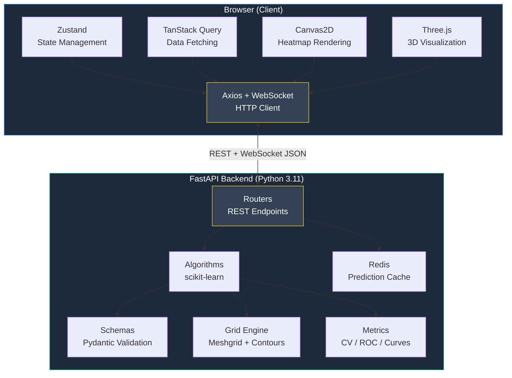
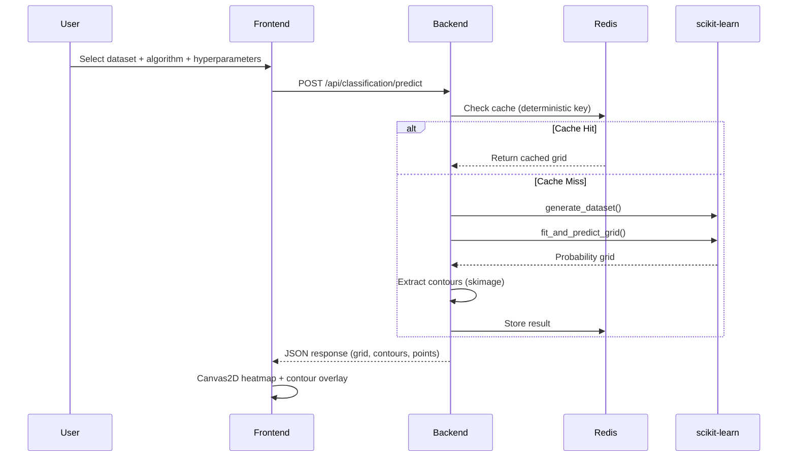
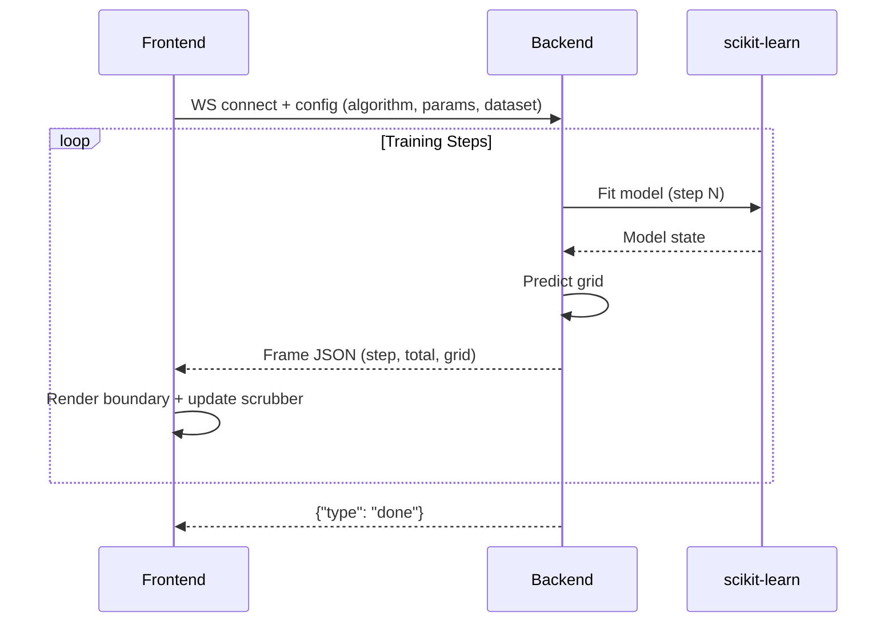

<div align="center">

<br />


<br />

An interactive, production-grade ML visualization platform backed by real scikit-learn computation.
Explore **38 algorithms** across classification, regression, clustering, and dimensionality reduction — with real-time hyperparameter tuning, decision boundary visualization, and training-process animation via WebSocket streaming.

<br />


<br />

[Getting Started](#-getting-started) · [Architecture](#-architecture) · [API Reference](#-api-reference) · [Algorithm Catalog](#-algorithm-catalog) · [Deployment](#-deployment) · [Contributing](CONTRIBUTING.md)

<br />


<br />

---

</div>

## Table of Contents

- [Why Confluence?](#-why-confluence)
- [Features](#-features)
- [Algorithm Encyclopedia](#algorithm-encyclopedia)
- [Getting Started](#-getting-started)
- [Architecture](#-architecture)
- [Project Structure](#-project-structure)
- [Algorithm Catalog](#-algorithm-catalog)
- [Dataset Catalog](#-dataset-catalog)
- [API Reference](#-api-reference)
- [WebSocket Streaming](#-websocket-streaming)
- [Deployment](#-deployment)
- [Configuration](#-configuration)
- [Verification & Testing](#-verification--testing)
- [Tech Stack](#-tech-stack)
- [Performance & Caching](#-performance--caching)
- [Roadmap](#-roadmap)
- [Contributing](#-contributing)
- [License](#-license)

---

## Why Confluence?

Most ML visualization tools fall into two traps:

| Trap | Example | Problem |
|------|---------|---------|
| **Toy and shallow** | TensorFlow Playground, CodePen demos | Client-side-only math, covers 3-4 algorithms, no regression/clustering/dim-reduction |
| **Static and academic** | scikit-learn gallery, Distill.pub | Good math, zero interactivity, fixed datasets, no hyperparameter exploration |

**Confluence closes the gap** — a unified, interactive ML visualization platform backed by genuine `scikit-learn`-class computation (not reimplemented approximations), spanning four algorithm families, with synchronized comparison, training-process animation, and a geometric taxonomy of decision boundaries as the organizing idea.

### Core Differentiators

```
┌─────────────────────────────────────────────────────────────────────┐
│  1. Boundary Taxonomy        Algorithms tagged by geometric shape   │
│  2. Four Families, One UI    Classification · Regression · Cluster  │
│  3. Real Computation         Actual scikit-learn, not toy math      │
│  4. Training Dynamics        Watch boosting rounds / tree growth    │
│  5. Side-by-Side Compare     2-4 algorithms on the same dataset     │
│  6. 3D Where It Matters      GP uncertainty bands, 3D projections   │
└─────────────────────────────────────────────────────────────────────┘
```

---

## Features

### Visualization Engine
- **Decision boundaries** rendered as Canvas2D heatmaps with crisp contour overlays
- **Real-time hyperparameter sliders** with debounced recompute (resolution 1-200)
- **Probability gradients** — see confidence, not just class labels
- **3D mode** via Three.js/react-three-fiber for GP uncertainty surfaces and embedding projections

### Data Pipeline
- **12 built-in datasets** — synthetic (blobs, moons, spirals, XOR, checkerboard) + real-world (Iris, Wine, Breast Cancer)
- **CSV upload** with column mapping, auto-detection of numeric columns
- **Custom point placement** — click-to-draw on canvas
- **Algorithm recommendation engine** based on dataset characteristics (size, balance, dimensionality)

### Analysis Tools
- **Classification metrics**: accuracy, precision, recall, F1, confusion matrix, ROC/AUC, log loss
- **Regression metrics**: R², MSE, RMSE, MAE, residual plots
- **Clustering metrics**: silhouette score, Davies-Bouldin index, inertia
- **Cross-validation** with per-fold boundary visualization
- **Coefficient inspector** for linear/tree models
- **Learning curves** showing train vs. validation performance
- **Sensitivity heatmaps** for hyperparameter interaction analysis
- **Decision path viewer** for tree-based models

### Comparison & Exploration
- **Side-by-side mode**: 2-4 algorithms on the same dataset with synchronized zoom/pan
- **Boundary taxonomy explorer**: filter algorithms by geometric boundary type
- **Algorithm encyclopedia**: 38 algorithms with complexity, intuition, and SVG diagrams

### Streaming & Animation
- **WebSocket training animation**: watch boosting rounds, tree growth, gradient descent, MLP epochs frame-by-frame
- **Scrubber timeline** for stepping through training stages

---

## Algorithm Encyclopedia

Confluence ships with a dedicated **Algorithm Encyclopedia** — an interactive reference covering all 38 algorithms with rich detail, organized by family.


### What the Encyclopedia Offers

| Feature | Description |
|---------|-------------|
| **38 Algorithm Cards** | Every algorithm across classification, regression, clustering, and dimensionality reduction — each with a one-line intuition, complexity notes, and boundary taxonomy tag |
| **Organized by Family** | Algorithms are grouped into four families with clear visual separation — Classification, Regression, Clustering, and Dimensionality Reduction |
| **Boundary Taxonomy Tags** | Each algorithm is tagged by the geometric shape of its decision boundary — Linear, Tree-Based, Instance-Based, Margin/Kernel, Probabilistic, Neural, Boosting, and more |
| **Search & Filter** | Instantly search algorithms by name or filter by family to find the right tool for your dataset |
| **Complexity Reference** | Every card shows Big-O complexity for both fit and predict operations, helping you reason about scalability |
| **SVG Diagrams** | Visual diagrams illustrate the intuition behind each algorithm's decision-making process |
| **Interactive Launch** | Click any algorithm card to jump directly into the visualizer with that algorithm pre-selected |

### Why It Matters

- **Learning** — Students and practitioners can build intuition for how different model families produce different boundary geometries
- **Selection** — The taxonomy-based organization helps you quickly narrow down candidate algorithms based on the shape of boundary your problem requires
- **Comparison** — Side-by-side complexity and boundary type information makes trade-offs immediately visible
- **Reference** — A single, always-up-to-date source of truth for every algorithm in the platform

---

## Getting Started

### Prerequisites

| Tool | Version | Check |
|------|---------|-------|
| Python | 3.11+ | `python --version` |
| Node.js | 20+ | `node --version` |
| Redis | 7+ (optional) | `redis-cli ping` |

### Quick Start (Local Development)

```bash
# 1. Clone
git clone <repo-url>
cd Confluence

# 2. Backend
cd backend
pip install -r requirements.txt
python -m uvicorn app.main:app --reload --port 8000

# 3. Frontend (new terminal)
cd frontend
npm install
npm run dev
```

Open **[http://localhost:3000](http://localhost:3000)** → click **Launch App** → select an algorithm and dataset.

### Docker Compose (Recommended for Full Stack)

```bash
docker compose up --build
```

This starts three services:
- `frontend` — Next.js on port 3000
- `backend` — FastAPI on port 8000
- `redis` — Redis on port 6379

### Verify Installation

```bash
make typecheck     # Frontend TypeScript
make lint          # Frontend ESLint
make test-backend  # Backend pytest
```

Or on Windows:

```powershell
.\verify.ps1 -All
```

---

## Architecture

### System Overview



### Data Flow: Static Boundary Request



### Data Flow: WebSocket Training Animation



---

## Project Structure

```
Confluence/
├── backend/
│   ├── app/
│   │   ├── main.py                    # FastAPI app, CORS, exception handlers
│   │   ├── cache.py                   # Redis caching layer (async)
│   │   ├── grid.py                    # Meshgrid generation + contour extraction
│   │   ├── algorithms/
│   │   │   ├── classification.py      # 15 classification algorithms
│   │   │   ├── regression.py          # 13 regression algorithms
│   │   │   ├── clustering.py          # 5 clustering algorithms
│   │   │   ├── dim_reduction.py       # 5 dimensionality reduction algorithms
│   │   │   ├── datasets.py            # 12 dataset generators
│   │   │   └── metrics.py             # Metrics, CV, learning curves, sensitivity
│   │   ├── models/
│   │   │   └── schemas.py             # Pydantic request/response models (240 lines)
│   │   └── routers/
│   │       ├── classification.py      # Classification endpoints (8 routes)
│   │       ├── regression.py          # Regression endpoints (5 routes)
│   │       ├── clustering.py          # Clustering endpoints (3 routes)
│   │       ├── dim_reduction.py       # Dim-reduction endpoints (2 routes)
│   │       ├── datasets.py            # CSV upload, custom points, recommendations
│   │       ├── health.py              # Health check
│   │       └── streaming.py           # WebSocket training animation
│   ├── tests/                         # 12 test files (pytest + httpx)
│   ├── Dockerfile
│   ├── requirements.txt
│   └── pyproject.toml
│
├── frontend/
│   ├── src/
│   │   ├── app/
│   │   │   ├── page.tsx               # Landing page
│   │   │   ├── app/page.tsx           # Main visualizer (477 lines)
│   │   │   └── algorithms/page.tsx    # Algorithm encyclopedia
│   │   ├── components/
│   │   │   ├── canvas/                # Canvas2D renderers (7 files)
│   │   │   ├── comparison/            # Side-by-side comparison mode
│   │   │   ├── controls/              # Algorithm panel, sliders, upload
│   │   │   ├── landing/               # Landing page animations
│   │   │   ├── layout/                # Navbar, footer
│   │   │   ├── metrics/               # 9 metric visualization components
│   │   │   ├── streaming/             # WebSocket training viz
│   │   │   ├── taxonomy/              # Boundary taxonomy explorer
│   │   │   ├── three/                 # 3D scene (Three.js)
│   │   │   └── ui/                    # URL state, theme toggle
│   │   └── lib/
│   │       ├── api/client.ts          # Axios API client + typed functions
│   │       ├── api/types.ts           # Auto-generated OpenAPI types
│   │       ├── store/index.ts         # Zustand store (38 algorithms)
│   │       └── taxonomy/index.ts      # Boundary taxonomy definitions
│   ├── Dockerfile
│   ├── package.json
│   ├── tsconfig.json
│   └── next.config.ts
│
├── docs/
│   ├── deployment.md                  # Full deployment guide
│   ├── API.md                         # API reference
│   ├── ARCHITECTURE.md                # System architecture
│   └── DEVELOPMENT.md                 # Developer guide
│
├── docker-compose.yml                 # 3-service orchestration
├── Makefile                           # Build commands
├── CONTRIBUTING.md                    # Contribution guidelines
├── .env.example                       # Environment variable template
├── .nvmrc                             # Node.js 20
└── .python-version                    # Python 3.11
```

---

## Algorithm Catalog

### Classification (15 algorithms)

| Algorithm | Key | Boundary Type | Complexity (Fit) | Complexity (Predict) |
|-----------|-----|---------------|------------------|---------------------|
| Logistic Regression | `logistic-regression` | Linear | O(n·d) | O(d) |
| K-Nearest Neighbors | `knn` | Instance-Based | O(1) | O(n·d) |
| Decision Tree | `decision-tree` | Tree-Based | O(n·d·log n) | O(log n) |
| SVM (RBF) | `rbf-svm` | Margin / Kernel | O(n²·d) | O(sv·d) |
| SVM (Linear) | `linear-svm` | Linear | O(n·d) | O(d) |
| SVM (Polynomial) | `poly-svm` | Margin / Kernel | O(n²·d) | O(sv·d) |
| Random Forest | `random-forest` | Tree-Based | O(k·n·d·log n) | O(k·log n) |
| Extra Trees | `extra-trees` | Tree-Based | O(k·n·d·log n) | O(k·log n) |
| AdaBoost | `adaboost` | Boosting | O(T·n·d) | O(T) |
| Gradient Boosting | `gradient-boosting` | Boosting | O(T·n·d·log n) | O(T·log n) |
| Gaussian Naive Bayes | `gaussian-nb` | Probabilistic | O(n·d) | O(d) |
| QDA | `qda` | Probabilistic | O(n·d²) | O(d²) |
| Gaussian Process | `gp-classifier` | Probabilistic | O(n³) | O(n²) |
| Perceptron | `perceptron` | Linear | O(n·d·i) | O(d) |
| MLP Classifier | `mlp` | Neural | O(n·d·h·i) | O(d·h) |

### Regression (13 algorithms)

| Algorithm | Key | Boundary Type | Complexity (Fit) |
|-----------|-----|---------------|------------------|
| Linear Regression | `linear-regression` | Linear | O(n·d²) |
| Ridge | `ridge` | Linear | O(n·d²) |
| Lasso | `lasso` | Linear | O(n·d·i) |
| Elastic Net | `elastic-net` | Linear | O(n·d·i) |
| Decision Tree Regressor | `decision-tree-regressor` | Tree-Based | O(n·d·log n) |
| Random Forest Regressor | `random-forest-regressor` | Tree-Based | O(k·n·d·log n) |
| Gradient Boosting Regressor | `gradient-boosting-regressor` | Boosting | O(T·n·d·log n) |
| SVR (Linear) | `svr-linear` | Margin / Kernel | O(n²·d) |
| SVR (RBF) | `svr-rbf` | Margin / Kernel | O(n²·d) |
| SVR (Polynomial) | `svr-poly` | Margin / Kernel | O(n²·d) |
| KNN Regressor | `knn-regressor` | Instance-Based | O(1) |
| Gaussian Process | `gaussian-process-regressor` | Probabilistic | O(n³) |
| MLP Regressor | `mlp-regressor` | Neural | O(n·d·h·i) |

### Clustering (5 algorithms)

| Algorithm | Key | Category |
|-----------|-----|----------|
| K-Means | `kmeans` | Centroid-Based |
| DBSCAN | `dbscan` | Density-Based |
| Agglomerative | `agglomerative` | Hierarchical |
| Gaussian Mixture | `gmm` | Distribution-Based |
| Spectral | `spectral` | Graph-Based |

### Dimensionality Reduction (5 algorithms)

| Algorithm | Key | Category |
|-----------|-----|----------|
| PCA | `pca` | Linear |
| t-SNE | `tsne` | Manifold |
| UMAP | `umap` | Manifold |
| Isomap | `isomap` | Manifold |
| LDA | `lda` | Linear |

---

## Dataset Catalog

### Synthetic (9)

| Dataset | Description | Classes | Best For |
|---------|-------------|---------|----------|
| `blobs` | Gaussian blobs | 2 | Linear classifiers |
| `blobs-3class` | Gaussian blobs | 3 | Multi-class |
| `blobs-4class` | Gaussian blobs | 4 | Multi-class |
| `moons` | Interleaving half circles | 2 | Nonlinear boundaries |
| `circles` | Concentric circles | 2 | Kernel methods |
| `spirals` | Spiral patterns | 2 | Complex nonlinear |
| `xor` | XOR distribution | 2 | Tree/kernel methods |
| `linearly-separable` | Linearly separable | 2 | Baseline linear |
| `checkerboard` | Checkerboard pattern | 2 | Piecewise boundaries |

### Real-World (3)

| Dataset | Features | Classes | Source |
|---------|----------|---------|--------|
| `iris` | petal length, petal width | 3 | Fisher's Iris |
| `wine` | alcohol, proline | 3 | UCI Wine |
| `breast-cancer` | mean radius, mean texture | 2 | Wisconsin Breast Cancer |

### Regression-Specific (1)

| Dataset | Description |
|---------|-------------|
| `sine` | sin(x) · cos(y) surface |

### Custom Data

- **CSV upload** — drag-and-drop any CSV, map columns to features/target
- **Custom points** — click on canvas to place points with class labels

---

## API Reference

### Base URL

| Environment | URL |
|-------------|-----|
| Local | `http://localhost:8000` |
| Docker | `http://backend:8000` |
| Production | `https://your-api-domain.com` |

### Endpoints

#### Health

```
GET /health
→ { "status": "ok", "version": "0.1.0" }
```

#### Classification (8 endpoints)

```
POST /api/classification/predict          → PredictionResponse
POST /api/classification/metrics          → ClassificationMetrics
POST /api/classification/cross-validation → CrossValidationResponse
POST /api/classification/coefficients     → CoefficientResponse
POST /api/classification/learning-curve   → LearningCurveResponse
POST /api/classification/sensitivity      → SensitivityResponse
POST /api/classification/decision-path    → DecisionPathResponse
GET  /api/classification/datasets         → DatasetListResponse
```

#### Regression (5 endpoints)

```
POST /api/regression/predict              → RegressionResponse
POST /api/regression/metrics              → RegressionMetricsResponse
POST /api/regression/learning-curve       → LearningCurveResponse
POST /api/regression/cross-validation     → CrossValidationResponse
GET  /api/regression/datasets             → DatasetListResponse
```

#### Clustering (3 endpoints)

```
POST /api/clustering/predict              → ClusteringResponse
POST /api/clustering/elbow                → ClusteringElbowResponse
GET  /api/clustering/datasets             → DatasetListResponse
```

#### Dimensionality Reduction (2 endpoints)

```
POST /api/dim-reduction/reduce            → DimReductionResponse
GET  /api/dim-reduction/algorithms        → AlgorithmListResponse
```

#### Datasets (4 endpoints)

```
POST /api/datasets/upload                 → UploadResponse
POST /api/datasets/map-columns            → ColumnMappingResponse
POST /api/datasets/custom                 → CustomPointsResponse
POST /api/datasets/recommend              → RecommendResponse
```

### Request/Response Examples

#### Predict Classification

```bash
curl -X POST http://localhost:8000/api/classification/predict \
  -H "Content-Type: application/json" \
  -d '{
    "algorithm": "random-forest",
    "dataset_name": "moons",
    "hyperparameters": { "n_estimators": 100 },
    "resolution": 100,
    "noise": 0.3,
    "n_samples": 300
  }'
```

Response:
```json
{
  "grid": [[0.98, 0.97, ...], ...],
  "contour_lines": [[[50.2, 30.1], [50.3, 30.2], ...]],
  "points": { "X": [[1.2, -0.5], ...], "y": [0, 1, ...] },
  "algorithm": "random-forest",
  "cache_hit": false,
  "grid_bounds": { "x_min": -3.5, "x_max": 3.5, "y_min": -3.5, "y_max": 3.5 }
}
```

### Input Constraints

| Field | Min | Max | Default |
|-------|-----|-----|---------|
| `resolution` | 1 | 200 | 100 |
| `n_samples` | 10 | 5000 | 300 |
| `noise` | 0 | 5 | 0.5 |
| `n_components` | 2 | 3 | 2 |
| `n_folds` | 3 | 10 | 5 |

### Interactive API Docs

- **Swagger UI**: [http://localhost:8000/docs](http://localhost:8000/docs)
- **ReDoc**: [http://localhost:8000/redoc](http://localhost:8000/redoc)
- **OpenAPI JSON**: [http://localhost:8000/openapi.json](http://localhost:8000/openapi.json)

---

## WebSocket Streaming

Stream training dynamics for staged algorithms via WebSocket.

### Supported Algorithms

| Algorithm | Stream Type | Frames |
|-----------|-------------|--------|
| `adaboost` | Boosting rounds | n_estimators / step |
| `gradient-boosting` | Boosting rounds | n_estimators / step |
| `random-forest` | Tree addition | n_estimators / step |
| `sgd` | Epoch-by-epoch | n_epochs |
| `decision-tree` | Depth growth | max_depth |
| `mlp` | Epoch-by-epoch | max_epochs |

### Protocol

```javascript
// Connect
const ws = new WebSocket("ws://localhost:8000/ws/stream");

// Send configuration
ws.send(JSON.stringify({
  algorithm: "gradient-boosting",
  hyperparameters: { n_estimators: 50 },
  dataset_name: "moons",
  resolution: 100
}));

// Receive frames
ws.onmessage = (event) => {
  const data = JSON.parse(event.data);
  if (data.type === "frame") {
    // data.step, data.total_steps, data.grid
    renderBoundary(data.grid);
  } else if (data.type === "done") {
    console.log("Training complete");
  }
};
```

### Input Bounds (DoS Protection)

| Parameter | Max Value |
|-----------|-----------|
| `resolution` | 200 |
| `n_estimators` | 200 |
| `max_depth` | 20 |
| `n_epochs` | 100 |
| `max_epochs` | 100 |

---

## Deployment

See **[docs/deployment.md](docs/deployment.md)** for full deployment guide covering:

| Platform | Frontend | Backend | Difficulty |
|----------|----------|---------|------------|
| Vercel + Fly.io | Vercel (free) | Fly.io (free tier) | Easy |
| Vercel + Railway | Vercel | Railway | Easy |
| Render | Static Site | Web Service | Easy |
| Docker Compose | Container | Container | Medium |
| Kubernetes | Pod | Pod | Advanced |

### Quick Deploy (Vercel + Fly.io)

```bash
# Backend
cd backend && fly launch --name confluence-backend --no-deploy
fly secrets set CORS_ORIGINS=https://your-frontend.vercel.app
fly deploy

# Frontend
cd frontend && vercel --prod
```

---

## Configuration

### Environment Variables

| Variable | Service | Required | Default | Description |
|----------|---------|----------|---------|-------------|
| `CORS_ORIGINS` | Backend | Yes | `http://localhost:3000` | Comma-separated allowed origins |
| `REDIS_URL` | Backend | No | `redis://localhost:6379` | Redis URL (gracefully degrades) |
| `LOG_LEVEL` | Backend | No | `INFO` | Logging level |
| `NEXT_PUBLIC_API_URL` | Frontend | Yes | `http://localhost:8000` | Backend API URL |

### Copy Environment Template

```bash
cp .env.example .env
```

---

## Verification & Testing

### Commands

```bash
make typecheck      # Frontend TypeScript type checking
make lint           # Frontend ESLint
make test-backend   # Backend pytest (12 test files)
make install        # Install all dependencies
```

### Windows (PowerShell)

```powershell
.\verify.ps1 -All           # Run all checks
.\verify.ps1 -Typecheck     # TypeScript only
.\verify.ps1 -TestBackend   # Backend tests only
.\verify.ps1 -Install       # Install dependencies
```

### CI Pipeline

GitHub Actions runs on every push:
- **Frontend job**: `npm ci` → `lint` → `typecheck` → `build`
- **Backend job**: `pip install` → import validation

---

## Tech Stack

| Layer | Technology | Purpose |
|-------|-----------|---------|
| **Framework** | Next.js 15 (App Router) | Routing, SSR/CSR, deploy target |
| **Language** | TypeScript 5 | Frontend type safety |
| **Styling** | Tailwind CSS 4 | Utility-first CSS |
| **Components** | Radix UI | Accessible primitives (Tabs, Slider, Dialog, Tooltip) |
| **Animation** | Framer Motion | Boundary morphs, panel transitions |
| **3D** | Three.js + react-three-fiber | GP surfaces, 3D projections |
| **Client State** | Zustand 5 | Algorithm/hyperparameter state |
| **Data Fetching** | TanStack Query 5 | Caching, dedup, request lifecycle |
| **HTTP Client** | Axios | API communication |
| **Backend** | FastAPI 0.115 | Prediction, metrics, streaming endpoints |
| **ML** | scikit-learn 1.6 | Real model fitting and prediction |
| **Numerics** | numpy 2.2, scipy 1.15 | Grid evaluation, contour extraction |
| **Contours** | scikit-image 0.25 | Contour extraction via `find_contours` |
| **Caching** | Redis 7 (optional) | Memoized prediction grids |
| **Validation** | Pydantic 2.10 | Request/response contracts |
| **Type Safety** | openapi-typescript | Auto-generated FE/BE type contracts |
| **Containers** | Docker Compose | Local dev + production parity |
| **Testing** | pytest + httpx | Backend test suite |

---

## Performance & Caching

### Redis Caching

Prediction grids are cached with a deterministic key based on:
- Algorithm name
- Hyperparameters (sorted)
- Dataset name
- Grid resolution

Cache TTL: **1 hour** (configurable). Redis is optional — the app works without it (caching disabled).

### Async ML Execution

All CPU-bound ML operations are wrapped in `asyncio.to_thread()` to prevent blocking the event loop:

```python
prob_grid, _ = await asyncio.to_thread(
    fit_and_predict_grid,
    request.algorithm, request.hyperparameters, X, y, xx, yy
)
```

### Resource Limits (Docker)

| Service | Memory | CPUs |
|---------|--------|------|
| Frontend | 512MB | 1.0 |
| Backend | 1GB | 2.0 |
| Redis | 256MB | 0.5 |

---

## Roadmap

### Completed

- 38 algorithms across 4 families
- Real-time decision boundary visualization
- Hyperparameter tuning with sliders
- CSV upload and custom point placement
- Side-by-side comparison mode
- Boundary taxonomy explorer
- WebSocket training animation
- Algorithm recommendation engine
- Cross-validation visualization
- Learning curves and sensitivity heatmaps
- Redis caching layer
- Docker Compose orchestration
- CI pipeline (GitHub Actions)
- Auto-generated TypeScript types from OpenAPI

### Planned

- Framer Motion boundary morphing (smooth transitions)
- Support vector / centroid overlays
- Dendrogram view for hierarchical clustering
- Math/pseudocode panels (KaTeX)
- XGBoost / LightGBM integration
- 3D classification volumes
- GP uncertainty surfaces in 3D
- Pyodide WASM fallback for backend-less deploy

---

## Contributing

See **[CONTRIBUTING.md](CONTRIBUTING.md)** for development setup, code quality standards, and guidelines for adding new algorithms.

---

## License

MIT

---

<div align="center">

**[Getting Started](#-getting-started)** · **[Architecture](#-architecture)** · **[API Reference](#-api-reference)** · **[Deployment](#-deployment)** · **[Contributing](CONTRIBUTING.md)**

</div>
